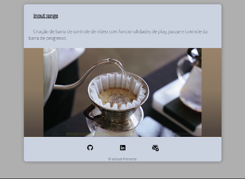
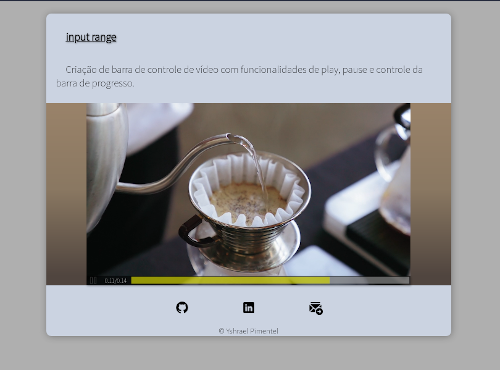
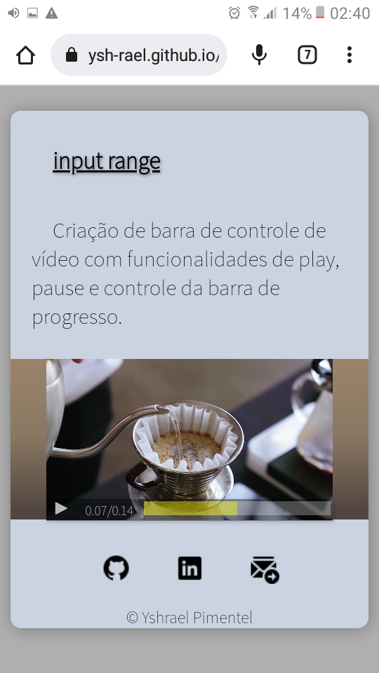
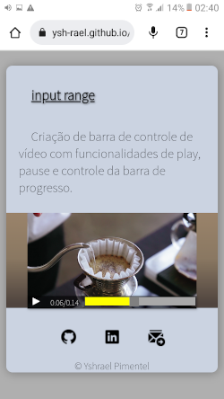

Here are the technologies used in this project.
 

* JavaScript
* Html5
* CSS3

under development
* NodeJs v16.13.1
* npm v8.1.2
* Browser-sync
* GIMP v2.0
 
 
## Services Used
 
* Github
 
<!-- ## Ruby Gems
... -->
 
## Getting started
 
* To Download:

>	Ubuntu, Debian, Mint, others:<br>
	  ```
	 	 sudo apt-get install wget
	  ```

>	Fedora, CentOS:<br>
	```
		dnf install wget
	```<br>
	```
		yum install wget
	```

>	openSUSE:<br>
	```
		zypper install wget
	```

>	after installing:<br>
	```
		wget https://github.com/ysh-rael/input-range/archive/refs/heads/main.zip
	```

* To run the project:
>    [click here](https://ysh-rael.github.io/input-range/)
 
## How to use
 
Video control bar created from scratch.
in addition to pausing and playing, an input range was used to visually follow the video's progress and at the same time allow the video to advance and rewind just by dragging the bar cursor.<br>

The same button is used to pause and play the video, changing, in addition to its functionality, the icon and verifying that autoplay is activated to suit it.<br>


<video src="https://user-images.githubusercontent.com/79410863/150476081-9c352d80-7fb8-4925-a3f6-c5729a4dba10.mp4" width= "500"><br>
	
	
The bar is hidden, being visible when the mouse cursor is over it and, after a few seconds, it starts to disappear with a transition effect.<br>
	
	

<br>
fully responsive and mobile friendly<br>




	
 
 
## Features
 
 * Video control bar with features of:
	- play
	- pause
	- video timer
	- progress bar control.
 * Local video and image hosting
 * Favicon and logo
 * Responsive:
	- Mobile ✔️
	- Desktop ✔️
 
 
## Links
 
  - Link of deployed application: https://ysh-rael.github.io/input-range/
  - Repository: https://github.com/ysh-rael/input-range/
 
 
## Versioning
 
1.0.0.0
 
 
## Authors
 
* **Yshrael Pimentel**: @Ysh-rael (https://github.com/ysh-rael)
 
 
Please follow github and join us!
Thanks to visiting me and good coding!


